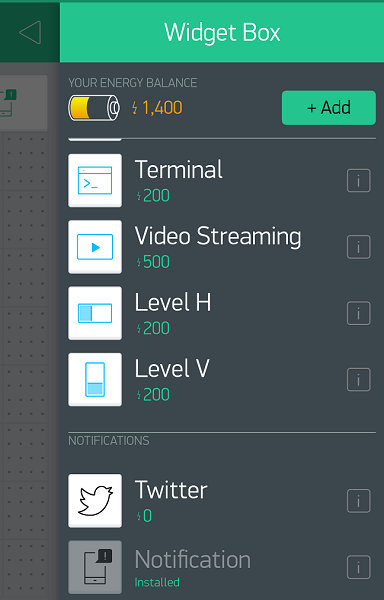

# IoT-DogBowl

IoT-DogBowl project which uses water level sensor with Node MCU and Wifi connection to Blynk app

# Step 1: Hardware

For the hardware you will need:

  *  NodeMCU Esp8266 - https://www.amazon.com/HiLetgo-Internet-Development-Wireless-Micropython/dp/B010O1G1ES/ref=sr_1_2_sspa?ie=UTF8&qid=1534954361&sr=8-2-spons&keywords=nodemcu+esp8266&psc=1
  *  Female/Female Jumper Wires - https://www.amazon.com/GenBasic-Female-Solderless-Breadboard-Prototyping/dp/B0788M1LZB/ref=sr_1_5?ie=UTF8&qid=1534954482&sr=8-5&keywords=female%2Ffemale+jumper+wires
  * Water Sensor - https://www.amazon.com/gp/product/B01N058HS6/ref=oh_aui_search_detailpage?ie=UTF8&psc=1

To connect the water sensor follow the chart above. The red letters represent the water sensor and the black sensors represent the Arduino. The different colored lines are the wires.

# Step 2: Downloads
You will need to download and install the [Arduino IDE](https://www.arduino.cc/en/Main/Software) based on your OS. Next create an account on the [Blynk Website](https://www.blynk.cc/). You will also have install the [Blynk app](https://play.google.com/store/apps/details?id=cc.blynk) on a compatible mobile device.

# Step 3: Setting Up the NodeMCU
This tutorial will help you set up the esp8266 NodeMCU: https://www.youtube.com/watch?v=G6CqvhXpBKM

You will need to do the following:

  *  Install the Drivers
  *  Install the Library
  *  Recognizing the NodeMCU
  *  Test the NodeMCU

Note: I will not be going over this step in depth because there are already a lot of great tutorials out there.

# Step 4: Installing Blynk Library

Installing the Blynk library is really simple just follow the [Blynk tutorial](http://help.blynk.cc/getting-started-library-auth-token-code-examples/how-to-install-blynk-library-for-arduino).

# Step 5: Creating a Blynk Project

  1. On the Blynk app select "New Project" and name the project. Next, in the new device panel select "ESP8266 (Wi-Fi)" and then select create. 
  

  2. After you have created your project swipe from the right to left to open up the widgets menu. 
  

  3. Scroll down and select "Level V" next click on the widget and under the "INPUT" navigate to PIN> Analog> adc0.

# Step 6: Uploading the Code
Download the code [here](https://github.com/SachinPawaskarUNO/IoT-DogBowl/blob/master/Water_Bowl1/Water_Bowl1.ino). Next open the code in the Arduino IDE paste the Blynk auth token where it is indicated. Type in your wifi name and password then select upload. After the code is uploaded you can test it out by putting the water sensor in some water. The Blynk app should show that the device is connected and the widget should display the water value if everything went correctly.

Note: I will continue to update the instructions.
